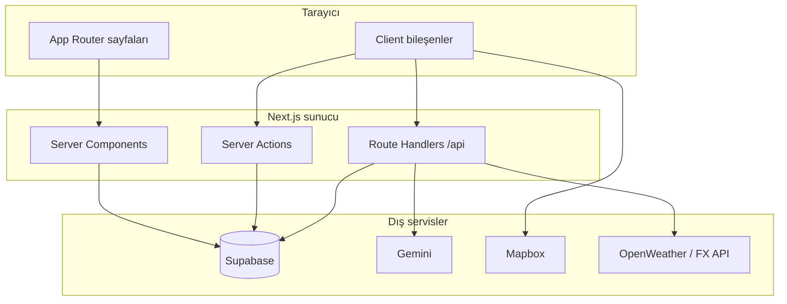

# Tour It — Code Review Hazırlık Dökümanı

Bu döküman, ekip code review oturumuna hazırlanmanız için hazırlanmıştır. Her bölümde **sorumlu kişi**, o modülün **dosya listesi**, dosyanın **ne işe yaradığı**, **silinirse ekranda ne kaybolur** ve **yeni özellik eklerken nereye dokunulur** anlatılır.

**Proje kökü:** `tour_it-main/`  
**Çalıştırma:** `cd tour_it-main && npm run dev` → http://localhost:3000  
**Stack:** Next.js 16 (App Router), React 19, Supabase (Auth + Postgres + RLS), Gemini API, Mapbox, Tailwind CSS 4

---

## İçindekiler

1. [Genel mimari](#1-genel-mimari)
2. [Son yapılan ürün değişiklikleri](#2-son-yapılan-ürün-değişiklikleri)
3. [Ege Özbil — Profile Module & Supabase](#3-ege-özbil--profile-module--supabase)
4. [Mustafa Hakan Durgut — Planner Module](#4-mustafa-hakan-durgut--planner-module)
5. [Umut Alp Dargün — Utility Module](#5-umut-alp-dargün--utility-module)
6. [Gökce Yıldırım — Community Module](#6-gökce-yıldırım--community-module)
7. [Yiğit Kızıldaş — Explore Module](#7-yiğit-kızıldaş--explore-module)
8. [Melih Yurt — Frontend (kabuk, ana sayfa, paylaşılan UI)](#8-melih-yurt--frontend-kabuk-ana-sayfa-paylaşılan-ui)
9. [Ortam değişkenleri](#9-ortam-değişkenleri)
10. [Code review kontrol listesi](#10-code-review-kontrol-listesi)

---

## 1. Genel mimari



| Katman | Rol |
|--------|-----|
| `src/app/**/page.tsx` | Route girişleri; çoğu veriyi sunucuda okur |
| `src/app/actions/*.ts` | Form/mutation — Supabase yazma |
| `src/app/api/**/route.ts` | JSON API (itinerary, hava, kur) |
| `src/components/**` | UI parçaları |
| `src/lib/**` | İş kuralları, yardımcılar, Supabase client |
| `supabase/*.sql` | Şema, RLS, migration |

**Veri akışı — plan üretimi ve kayıt:**

1. Kullanıcı `/plan` formunu doldurur → `PlanWorkspace` → `POST /api/itinerary` (Gemini).
2. Başarılı yanıt → otomatik `savePlanToDatabase` (`actions/plan.ts`) → `plans` + `plan_days` + `plan_items`.
3. “Share publicly in Explore” işaretliyse `is_public = true` → `/explore` ve ana sayfa listesinde görünür.
4. Profilde “My plans” → tıklanınca `/plan?id=<uuid>` → `loadPlanFromDatabase` ile itinerary yüklenir.

---

## 2. Son yapılan ürün değişiklikleri

| # | İstek | Uygulama |
|---|--------|----------|
| 1 | “Save plan” kaldır, generate’de otomatik kayıt | `PlanWorkspace`: generate sonrası `persistPlan()`; buton kaldırıldı |
| 2 | Slider 0/25/50/75/100 | `sliderSteps.ts` + range `step={25}` + alt etiketler |
| 3 | Explore çalışmıyor | `publicPlans.ts`: embed yerine iki aşamalı sorgu; filtreler Nature/Urban eklendi |
| 4 | Dil İngilizce | `itinerary/route.ts` prompt İngilizce; `MapboxMap` hata metni İngilizce |
| 5 | My plans → plan sayfası | `UserPlansList` → `/plan?id=`; `loadPlanFromDatabase` |

---

## 3. Ege Özbil — Profile Module & Supabase

### 3.1 Sorumluluk özeti

- Kullanıcı profili (görüntüleme / düzenleme)
- Takip (follow) butonu
- “My plans” ve “Public plans” listeleri (veri çekimi sayfa tarafında; liste bileşeni paylaşımlı)
- Supabase şema, RLS, migration, auth callback

### 3.2 Dosya envanteri

#### Routes (sayfalar)

| Dosya | Ne yapar? | Silinirse |
|-------|-----------|-----------|
| `src/app/profile/page.tsx` | Giriş yapmış kullanıcının kendi profili: form, planlar, postlar, takipçi sayıları | `/profile` 404; header’daki Profile linki boşa düşer |
| `src/app/profile/[id]/page.tsx` | Başka kullanıcının public profili + public planları | Başka kullanıcı profili açılamaz |
| `src/app/login/page.tsx` | Giriş sayfası kabuğu | Email girişi sayfası yok |
| `src/app/login/login-form.tsx` | Magic link / OTP formu (client) | Form render olmaz |
| `src/app/auth/callback/route.ts` | Supabase OAuth/magic link callback; cookie oturumu | Giriş tamamlanamaz |

#### Server actions

| Dosya | Ne yapar? | Silinirse |
|-------|-----------|-----------|
| `src/app/actions/profile.ts` | `updateProfile`: display_name, bio, avatar_url günceller | Profil kaydetme çalışmaz |

#### Bileşenler

| Dosya | Ne yapar? | Silinirse |
|-------|-----------|-----------|
| `src/components/profile/ProfileForm.tsx` | Düzenlenebilir profil formu; `updateProfile` action’a POST | Profil alanları düzenlenemez |
| `src/components/profile/Avatar.tsx` | Yuvarlak avatar (URL veya harf fallback) | Header ve profilde avatar yok |
| `src/components/profile/FollowButton.tsx` | Takip et / bırak (server action) | Takip özelliği UI’da yok |
| `src/components/profile/UserPlansList.tsx` | Kayıtlı plan kart listesi; her satır `Link` → `/plan?id=` | Plan listesi görünmez veya tıklanamaz |
| `src/components/profile/UserPostsList.tsx` | Kullanıcının community post özeti | Profilde “recent posts” kaybolur |

#### Supabase istemcileri & auth

| Dosya | Ne yapar? | Silinirse |
|-------|-----------|-----------|
| `src/lib/supabase/server.ts` | Sunucu tarafı Supabase client (cookie) | Tüm server read/write kırılır |
| `src/lib/supabase/client.ts` | Tarayıcı Supabase client | Client-side auth işlemleri kırılır |
| `src/lib/supabase/env.ts` | URL/key okuma; `isSupabaseConfigured()` | Yanlış yapılandırma kontrolü yok |
| `src/lib/supabase/middleware.ts` | Oturum yenileme; `/plan` için auth redirect | Plan sayfası korumasız kalır |
| `src/middleware.ts` | Root middleware → `updateSession` | Session cookie güncellenmez |
| `src/lib/auth/role.ts` | Admin rolü yardımcıları | Admin badge / moderasyon kontrolleri etkilenir |

#### Veritabanı (Supabase)

| Dosya | Ne yapar? | Silinirse |
|-------|-----------|-----------|
| `supabase/schema.sql` | Tam şema: profiles, plans, plan_days, plan_items, posts, comments, likes, follows, RLS | DB kurulum referansı yok |
| `supabase/migrations/002_erd_schema.sql` | ERD uyumlu migration | Eski DB’ler migrate edilemez |
| `supabase/migrations/003_nickname_metadata.sql` | Nickname / metadata | Profil alanları eksik kalabilir |
| `supabase/migrations/005_admin_role.sql` | Admin rolü ve politikalar | Admin moderasyon çalışmaz |

**Önemli tablolar (Ege review odak):**

- `profiles` — `auth.users` ile 1:1; `display_name`, `bio`, `avatar_url`, `role`
- `plans` — trip header + `preferences` JSON + `is_public`
- `plan_days` / `plan_items` — nested itinerary
- `follows` — follower_id / following_id

**RLS (plans):**

- Herkes: `is_public = true` planları okuyabilir
- Sahip: kendi planlarını okur/yazar
- `plan_days` / `plan_items` erişimi üst plandaki public/owner kuralına bağlı

### 3.3 Yeni özellik eklerken

| Özellik | Nereye |
|---------|--------|
| Yeni profil alanı | Migration → `profiles` kolon → `ProfileForm` + `updateProfile` + `profile/page.tsx` select |
| Plan silme | `actions/plan.ts` → `deletePlan` + RLS policy kontrolü |
| Avatar upload (storage) | Supabase Storage bucket + `ProfileForm` + `updateProfile` |
| Başkasının private planını gizle | Zaten RLS; client’ta ekstra kontrol `loadPlanFromDatabase` |

### 3.4 Review soruları (Ege)

- [ ] `profiles` trigger yeni kullanıcıda satır oluşturuyor mu?
- [ ] `005_admin_role.sql` production’da uygulandı mı?
- [ ] `UserPlansList` linkleri doğru `plan id` ile mi gidiyor?
- [ ] Follow RLS: sadece authenticated insert/delete?

---

## 4. Mustafa Hakan Durgut — Planner Module

### 4.1 Sorumluluk özeti

- `/plan` sayfası: form, tercih slider’ları, AI generate, harita, itinerary paneli
- Plan kaydetme / yükleme server actions
- Gemini prompt, Zod şema, tercih → prompt metni

### 4.2 Dosya envanteri

#### Routes & API

| Dosya | Ne yapar? | Silinirse |
|-------|-----------|-----------|
| `src/app/plan/page.tsx` | `/plan` route; `Suspense` + `PlanWorkspace` | Plan sayfası yok |
| `src/app/api/itinerary/route.ts` | `POST`: Gemini ile JSON itinerary üretir; **İngilizce** çıktı zorunlu | Generate itinerary tamamen durur |

#### Server actions

| Dosya | Ne yapar? | Silinirse |
|-------|-----------|-----------|
| `src/app/actions/plan.ts` | `savePlanToDatabase`, `loadPlanFromDatabase`, `togglePlanVisibility` | Kayıt/yükleme/görünürlük yok |

**`savePlanToDatabase` akışı:**

1. `plans` insert (title, country, city, trip_type, preferences, is_public)
2. Her gün için `plan_days` insert
3. Her aktivite için `plan_items` insert

**`loadPlanFromDatabase`:** Header + günler + item’lar → `ItineraryPlan` tipine map (owner veya public).

#### Bileşenler

| Dosya | Ne yapar? | Silinirse |
|-------|-----------|-----------|
| `src/components/plan/PlanWorkspace.tsx` | Ana planner UI: form, generate, otomatik save, `?id=` ile yükleme | `/plan` boş sayfa |
| `src/components/plan/ItineraryPanel.tsx` | Gün gün aktivite listesi (sağ/sol kolon) | Metin itinerary görünmez |
| `src/components/plan/MapboxMap.tsx` | Mapbox GL harita + pinler | Harita alanı boş / token uyarısı |

#### Lib / types

| Dosya | Ne yapar? | Silinirse |
|-------|-----------|-----------|
| `src/lib/itinerary/preferences.ts` | Slider/enum → İngilizce prompt cümleleri + UI özet token’ları | AI tercihleri yok sayar; özet pill’ler bozulur |
| `src/lib/itinerary/schema.ts` | Zod: Gemini JSON doğrulama | Geçersiz JSON kabul edilebilir |
| `src/lib/itinerary/apiErrors.ts` | HTTP hata → kullanıcı dostu mesaj | Ham hata metinleri |
| `src/lib/itinerary/sliderSteps.ts` | 0,25,50,75,100 snap | Slider her değeri alır (ürün kuralı bozulur) |
| `src/types/itinerary.ts` | `ItineraryPlan`, `DayPlan`, `PlaceActivity` tipleri | TS tip güvenliği kırılır |
| `src/types/planner.ts` | `PlannerDraftState` (draft henüz UI’da yok) | Gelecek draft özelliği |
| `src/data/popularCities.ts` | Ülke/şehir listesi (form select) | Plan formunda destinasyon seçimi yok |

### 4.3 Kritik UI davranışları (güncel)

- **Otomatik kayıt:** `handleGenerate` başarılı olunca `persistPlan()` çağrılır.
- **Public paylaşım:** Generate **öncesi** “Share publicly in Explore” checkbox; `savePublic` → `is_public`.
- **Slider:** `step={25}`, `snapPreferenceSlider`, altında 0–100 etiketleri.
- **Kayıtlı plan açma:** URL `?id=<plan_uuid>` → `useEffect` → `loadPlanFromDatabase`.

### 4.4 Yeni özellik eklerken

| Özellik | Nereye |
|---------|--------|
| Mevcut planı güncelle (yeni satır açma) | `savePlanToDatabase` → upsert veya `updatePlan`; `PlanWorkspace`’te `savedPlanId` state |
| Draft otomatik kayıt | `planner_drafts` tablosu + `types/planner.ts` + periodic save in `PlanWorkspace` |
| Yeni trip type | `tripTypes` const + explore filtreleri + Gemini prompt |
| Daha fazla tercih slider’ı | `PlanWorkspace` state + `preferences.ts` + `plan.ts` preferences JSON + API body |

### 4.5 Review soruları (Mustafa)

- [ ] Generate + save sırasında hata olursa kullanıcıya net mesaj var mı?
- [ ] Gemini prompt’taki 4 zorunlu kural slider ile uyumlu mu?
- [ ] `loadPlanFromDatabase` private planı başkasına kapatıyor mu?
- [ ] Mapbox token yokken itinerary paneli hâlâ çalışıyor mu?

---

## 5. Umut Alp Dargün — Utility Module

### 5.1 Sorumluluk özeti

- `/utility` sayfası: hava durumu, şehir saati, döviz kuru
- İki API route: weather, fx

### 5.2 Dosya envanteri

| Dosya | Ne yapar? | Silinirse |
|-------|-----------|-----------|
| `src/app/utility/page.tsx` | Route → `UtilityWorkspace` | `/utility` 404 |
| `src/components/utility/UtilityWorkspace.tsx` | 3 widget UI; `popularCities` seçimi; API fetch | Utility sayfası boş |
| `src/app/api/utility/weather/route.ts` | OpenWeather proxy (şehir / q parametreleri) | Hava kutusu veri almaz |
| `src/app/api/utility/fx/route.ts` | Döviz kuru proxy | FX kutusu veri almaz |
| `src/lib/utility/cityClock.ts` | UTC offset → duvar saati formatı | Saat widget’ı bozulur |
| `src/data/popularCities.ts` | Şehir listesi (Utility + Plan paylaşır) | Şehir seçiciler bozulur |

### 5.3 Veri akışı

```
UtilityWorkspace
  → GET /api/utility/weather?city=...&cc=...
  → GET /api/utility/fx?from=USD&to=EUR
  → cityClock (client-side offset)
```

### 5.4 Yeni özellik eklerken

| Özellik | Nereye |
|---------|--------|
| Yeni widget (ör. visa info) | `UtilityWorkspace` yeni section + isteğe `api/utility/...` |
| Yeni şehir | `popularCities.ts` |
| API key | `.env.local` (OpenWeather vb.) + route içinde env kontrolü |

### 5.5 Review soruları (Umut)

- [ ] API route’lar rate limit / hata gövdesi döndürüyor mu?
- [ ] “Other city” araması weather route’a doğru parametreyle gidiyor mu?
- [ ] FX formatı küçük/büyük kur için mantıklı mı (`formatRate`)?

---

## 6. Gökce Yıldırım — Community Module

### 6.1 Sorumluluk özeti

- `/community` feed: post listesi, beğeni, yorum, yeni post
- Server actions: create/delete post & comment, like, follow (follow profil modülüyle kesişir)

### 6.2 Dosya envanteri

| Dosya | Ne yapar? | Silinirse |
|-------|-----------|-----------|
| `src/app/community/page.tsx` | Post + yorumları Supabase’ten okur; `PostCardInteractive` map | Community feed yok |
| `src/app/actions/community.ts` | `createPost`, `deletePost`, yorumlar, like, vb. | Etkileşimler çalışmaz |
| `src/components/community/PostComposer.tsx` | Yeni post formu | Post atılamaz |
| `src/components/community/PostCardInteractive.tsx` | Tek post kartı + like + yorum thread tetikleyici | Feed kartları yok |
| `src/components/community/CommentThread.tsx` | İç içe yorumlar UI | Yorumlar görünmez |

**DB tabloları:** `posts`, `comments`, `post_likes`, (+ `profiles` join display_name)

### 6.3 Yeni özellik eklerken

| Özellik | Nereye |
|---------|--------|
| Yeni post kategorisi | `VALID_CATEGORIES` in `community.ts` + composer select |
| Görsel upload | Storage + `createPost` `image_url` |
| Post düzenleme | `updatePost` action + RLS update policy |

### 6.4 Review soruları (Gökce)

- [ ] Admin delete RLS `005_admin_role` ile uyumlu mu?
- [ ] Yorum parent/child `CommentThread` doğru mu?
- [ ] `revalidatePath('/community')` tüm mutation’larda var mı?

---

## 7. Yiğit Kızıldaş — Explore Module

### 7.1 Sorumluluk özeti

- `/explore`: `is_public = true` planların listelenmesi
- Trip type filtreleri
- Kartlardan kayıtlı plana gitme (`/plan?id=`)

### 7.2 Dosya envanteri

| Dosya | Ne yapar? | Silinirse |
|-------|-----------|-----------|
| `src/app/explore/page.tsx` | Server page: filtre chips + grid | Explore sayfası yok |
| `src/components/explore/PlanCard.tsx` | Kart UI; link `View plan →` `/plan?id=` | Kartlar veya deep link yok |
| `src/lib/plans/publicPlans.ts` | `fetchPublicPlanCards`: plans + ayrı profiles sorgusu | Explore/home public liste boş kalabilir |
| `src/lib/mock-data.ts` | `ExplorePlanCard` **tipi** (mock veri yok) | TS tipi kırılır |

**Filtreler (`explore/page.tsx`):** All, Relaxing, Adventure, Cultural, Nature, Urban

**Public plan görünmeme nedenleri (debug):**

1. `is_public = false` (checkbox generate öncesi kapalı)
2. Supabase env eksik → `isSupabaseConfigured()` false
3. Hiç public plan yok
4. Aktif filtre trip type’ı eşleşmiyor (ör. Cultural seçili, plan Urban)

### 7.3 Ana sayfa kesişimi

`src/app/page.tsx` → `loadRecentPublicPlans()` → `fetchPublicPlanCards({ limit: 3 })`  
Explore ile **aynı loader**; tutarlılık için değişiklikleri `publicPlans.ts`’te yapın.

### 7.4 Yeni özellik eklerken

| Özellik | Nereye |
|---------|--------|
| Sıralama (popüler, yeni) | `publicPlans.ts` order + explore query param |
| Arama (şehir) | `fetchPublicPlanCards` filtre + explore UI |
| Plan önizleme modal | `PlanCard` veya yeni client component + `loadPlanFromDatabase` |

### 7.5 Review soruları (Yiğit)

- [ ] İki aşamalı sorgu creator ismini doğru gösteriyor mu?
- [ ] `PlanCard` linki her zaman geçerli UUID ile mi?
- [ ] Boş state metni otomatik kayıt akışını anlatıyor mu?

---

## 8. Melih Yurt — Frontend (kabuk, ana sayfa, paylaşılan UI)

### 8.1 Sorumluluk özeti

- Root layout, header/footer, global stil
- Ana sayfa (hero, seasonal, featured, news, recent plans)
- Paylaşılan: `CityImage`, login akışı kabuğu, config uyarısı

### 8.2 Dosya envanteri

#### Layout & global

| Dosya | Ne yapar? | Silinirse |
|-------|-----------|-----------|
| `src/app/layout.tsx` | Root HTML, Poppins font, metadata, `MainShell` | Tüm sayfa chrome’suz |
| `src/app/globals.css` | Tailwind theme tokens (coral, cream, navy) | Marka renkleri / tipografi bozulur |
| `src/components/layout/MainShell.tsx` | Config notice + header + footer + auth user fetch | Header kullanıcı bilgisi yok |
| `src/components/layout/SiteHeader.tsx` | Nav: Home, Plan, Explore, Community, Utility, Profile | Üst menü yok |
| `src/components/layout/SiteFooter.tsx` | Alt bilgi | Footer yok |
| `src/components/layout/SignOutButton.tsx` | Çıkış | Oturum kapatılamaz |
| `src/components/layout/ConfigNotice.tsx` | Supabase yapılandırılmamış uyarısı | Sessiz config hatası |

#### Ana sayfa

| Dosya | Ne yapar? | Silinirse |
|-------|-----------|-----------|
| `src/app/page.tsx` | Hero, seasonal rails, featured cities, news, 3 public plan | `/` boş veya eksik |
| `src/components/home/HeroDiscoveryRail.tsx` | Mevsimsel “in season / coming up” şerit | Hero altı keşif şeridi yok |
| `src/lib/places/seasonalPicks.ts` | Aya göre şehir önerileri | Seasonal içerik statik kalmaz |

#### Paylaşılan UI

| Dosya | Ne yapar? | Silinirse |
|-------|-----------|-----------|
| `src/components/CityImage.tsx` | Unsplash/Wikipedia tabanlı şehir görseli | Plan/explore/home görselleri kırılır |
| `src/lib/getCityImage.ts` | Görsel URL arama mantığı | `CityImage` fallback |
| `src/lib/geo/countryName.ts` | ISO ülke adı | Utility/places’te ülke etiketi |
| `src/components/common/AdminBadge.tsx` | Admin rozeti | Admin görünürlüğü yok |

### 8.3 Navigasyon haritası

| Link (header) | Route |
|---------------|-------|
| Home | `/` |
| Plan | `/plan` (auth gerekli) |
| Explore | `/explore` |
| Community | `/community` |
| Utility | `/utility` |
| Profile | `/profile` |

### 8.4 Yeni özellik eklerken

| Özellik | Nereye |
|---------|--------|
| Yeni global nav item | `SiteHeader.tsx` `nav` dizisi |
| Tema / dark mode | `globals.css` + `layout.tsx` class |
| Yeni landing section | `page.tsx` + isteğe `components/home/` |

### 8.5 Review soruları (Melih)

- [ ] `lang="en"` root layout’ta mı?
- [ ] Mobil nav (`details` menü) tüm linkleri içeriyor mu?
- [ ] `CityImage` performansı (`sizes`, lazy) yeterli mi?

---

## 9. Ortam değişkenleri

| Değişken | Modül | Zorunlu? |
|----------|--------|----------|
| `NEXT_PUBLIC_SUPABASE_URL` | Supabase | Evet (prod) |
| `NEXT_PUBLIC_SUPABASE_ANON_KEY` | Supabase | Evet |
| `GEMINI_API_KEY` (veya alias) | Planner | Generate için |
| `NEXT_PUBLIC_MAPBOX_ACCESS_TOKEN` | Planner harita | Harita için |
| OpenWeather / FX key’leri | Utility API | Utility için |

Örnek: `.env.example` — kopyalayıp `.env.local` oluşturun.

---

## 10. Code review kontrol listesi

### Herkes (genel)

- [ ] `npm run build` hatasız
- [ ] `npm run lint` temiz
- [ ] İngilizce UI metinleri (yeni string’ler TR değil)
- [ ] RLS: client’ta gizlenen veri server’da da kapalı mı?

### Modül sahipleri

| Kişi | Odak dosya sayısı (~) | Mini demo senaryosu |
|------|------------------------|---------------------|
| Ege | profile + supabase (~15) | Profil düzenle → My plans → plan aç |
| Mustafa | plan + itinerary (~12) | Generate + public checkbox → Explore’da gör |
| Umut | utility (~5) | Istanbul hava + USD→TRY |
| Gökce | community (~5) | Post at → yorum → beğen |
| Yiğit | explore + publicPlans (~4) | Public plan listele → View plan |
| Melih | layout + home (~10) | Ana sayfa + mobil menü |

### Bilinen teknik borçlar (review’da konuşulabilir)

- Her **generate** yeni `plans` satırı açar (güncelleme yok)
- `planner_drafts` tablosu var, UI bağlı değil
- `togglePlanVisibility` action var, planner UI’da kullanılmıyor
- Middleware → Next 16 “proxy” uyarısı (gelecek migration)

---

## Ek: Dosya → modül hızlı indeks

| Dosya yolu | Birincil sahip |
|------------|----------------|
| `src/app/profile/**`, `src/app/actions/profile.ts`, `src/components/profile/**`, `src/lib/supabase/**`, `src/middleware.ts`, `supabase/**` | Ege |
| `src/app/plan/**`, `src/app/api/itinerary/**`, `src/app/actions/plan.ts`, `src/components/plan/**`, `src/lib/itinerary/**`, `src/types/itinerary.ts` | Mustafa |
| `src/app/utility/**`, `src/app/api/utility/**`, `src/components/utility/**`, `src/lib/utility/**` | Umut |
| `src/app/community/**`, `src/app/actions/community.ts`, `src/components/community/**` | Gökce |
| `src/app/explore/**`, `src/components/explore/**`, `src/lib/plans/publicPlans.ts` | Yiğit |
| `src/app/layout.tsx`, `src/app/page.tsx`, `src/app/login/**`, `src/components/layout/**`, `src/components/home/**`, `src/app/globals.css`, `src/components/CityImage.tsx` | Melih |

---

*Döküman sürümü: May 2026 — otomatik kayıt, explore loader, plan deep link ve İngilizce AI çıktısı değişikliklerini içerir.*
